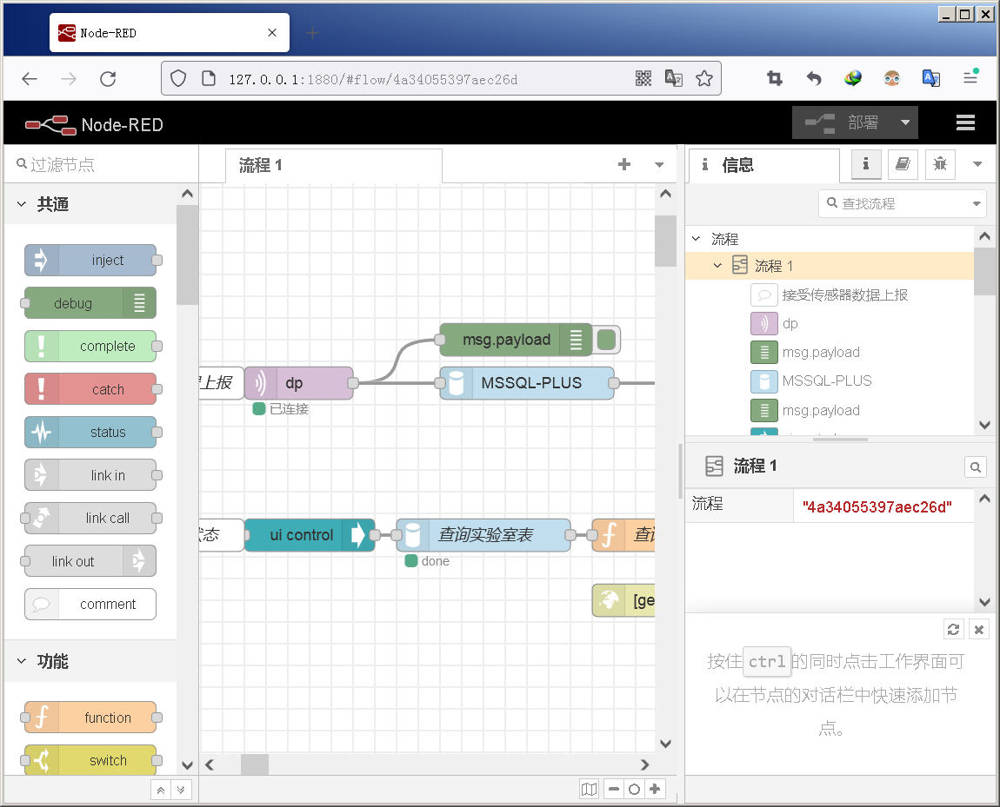
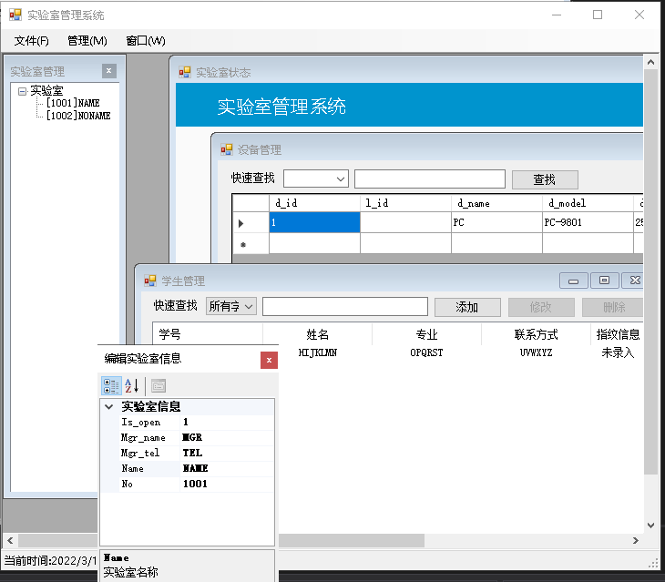
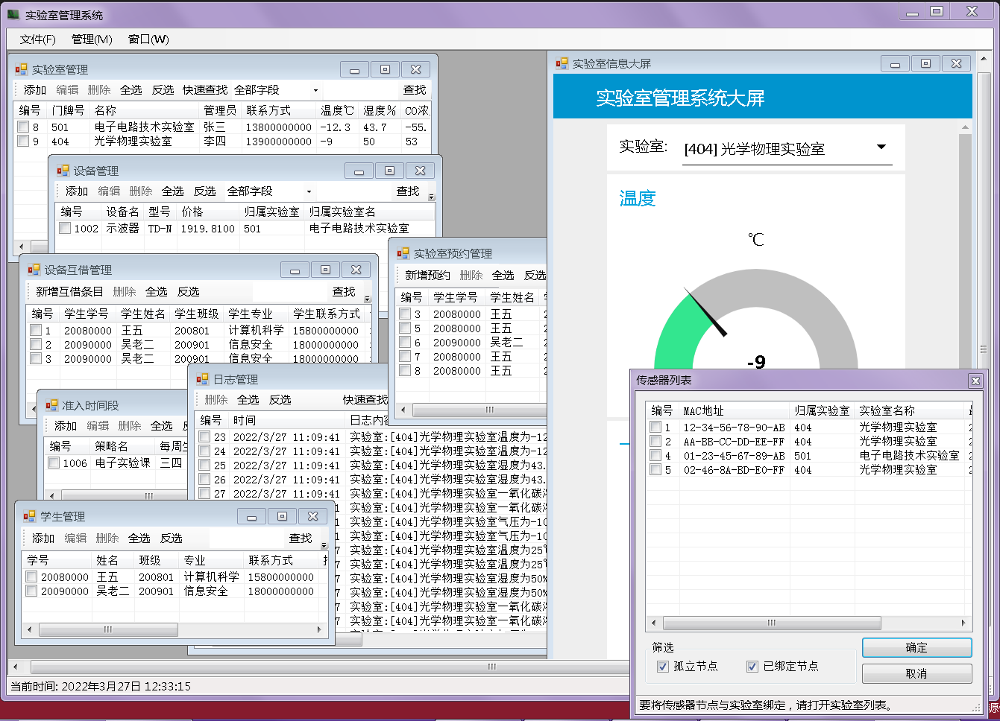
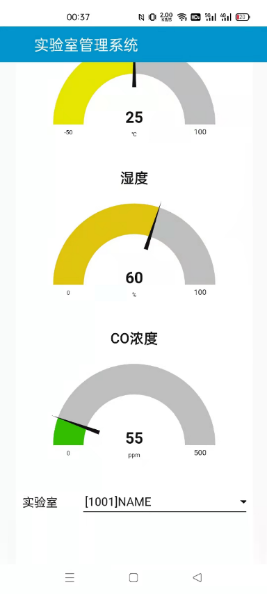
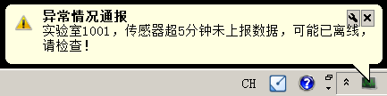
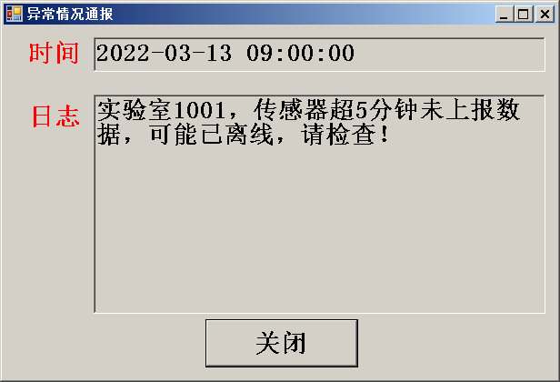

# LabClient

## The Repository

This repository is used to store the project code of the laboratory management system. At present, some client code developed by C# has been sorted out.

## Lab-Management-System 
University laboratory management system is composed of perception module, control module, transmission module, data processing module and application module. It relies on RFID, Internet of Things, sensor and other technologies, and Arduino Uno is the main carrier for hardware development. Data flow editor Node-Red, MQTT message Server EMQX, relational database management system SQL Server as the main software environment. C#, Java as the main development language, realizing the university laboratory environment real-time monitoring and security warning, personnel entry and exit management, equipment anti-theft management and other functions. 
It's worth mentioning that I think Node-RED is a great fit for rapid deployment of iot applications, as it requires only a simple operation and a small amount of code to deploy the data stream to the runtime environment.  
   

## Using
    
The PC client application uses Visual C# language and Visual Studio 2019 integrated development environment. The application uses multi-document interface, and each functional area is displayed in different sub-windows. The function division is clear and clear, which greatly increases the ease of use and interaction of the system.
 
   
The mobile client application is based on the Android mobile operating system. It developed by using Java language and Android Studio integrated development environment. The core function of the mobile client is to receive alerts, so that laboratory managers can respond to abnormal situations anytime and anywhere.

The overall architecture of the system determines that the client should adopt the C/S architecture with database as the center. For the PC client, Visual C# provides SQL Server access support using .NET. For the mobile client, using the third party package JTDS to achieve access to the database.

    
PC client message notification uses the dual notification mode of taskbar bubble and forced always in the first dialog box reminder to notify abnormal messages, aiming at enabling laboratory managers to respond in a timely manner. The mechanism of database query on the mobile client is the same as that on the PC, while the status bar Notification is used for message notification.

## Using
The code of the system is still in further collation, and currently you can directly download the PC client code to experience. In addition, the overall design, detailed design, functional implementation and other details of the system can be viewed in the paper (link below). Feel free to contact me if you have any questions or ideas (fablerr@163.com).

[1] Jiang Shengsheng, Wang Ruihua, Yang Bin, Yang Yao, Lang Zhaorui & Qi Yutian.(2022). University laboratory management system based on RFID and Internet of Things technology. Information Technology and Informatization (08),189-192.  
https://kns.cnki.net/kcms/detail/detail.aspx?dbcode=CJFD&dbname=CJFDLAST2022&filename=SDDZ202208048&uniplatform=NZKPT&v=xI4uj2mqXTP0Ht2Ycr-JXojRq5qzFMS-ksqSSkJ1Mvf3KCwZLvuxZK6wfxgaHvOL
